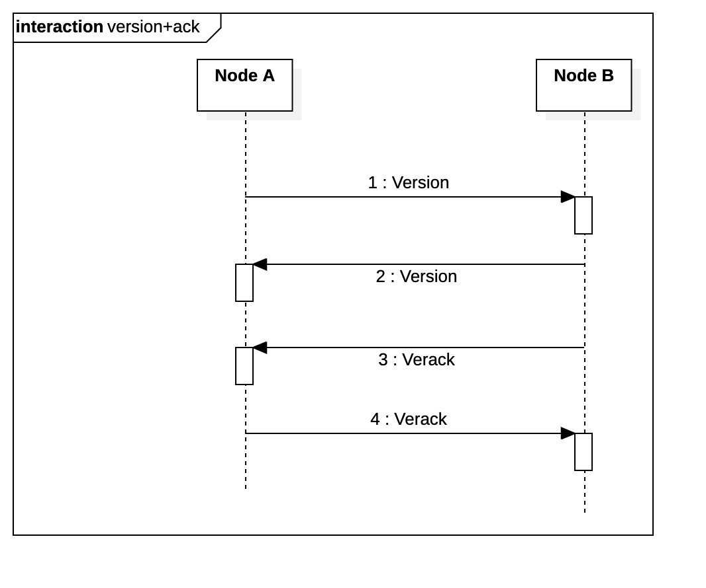
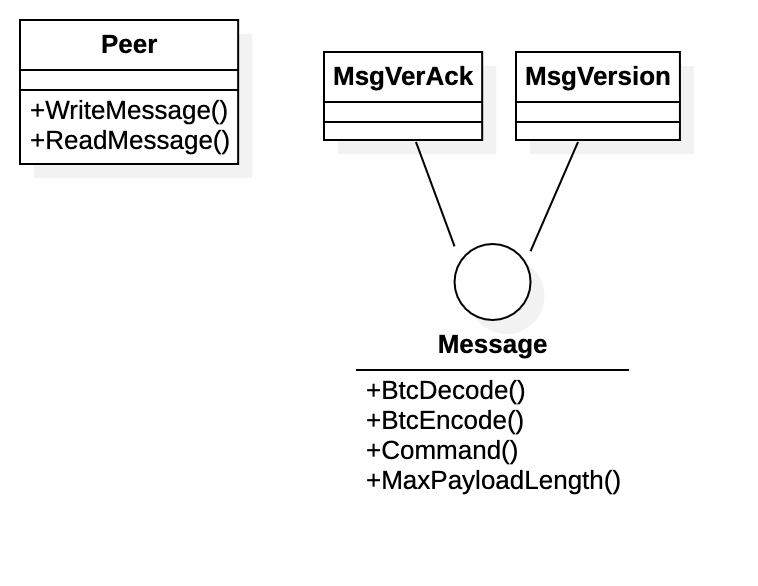
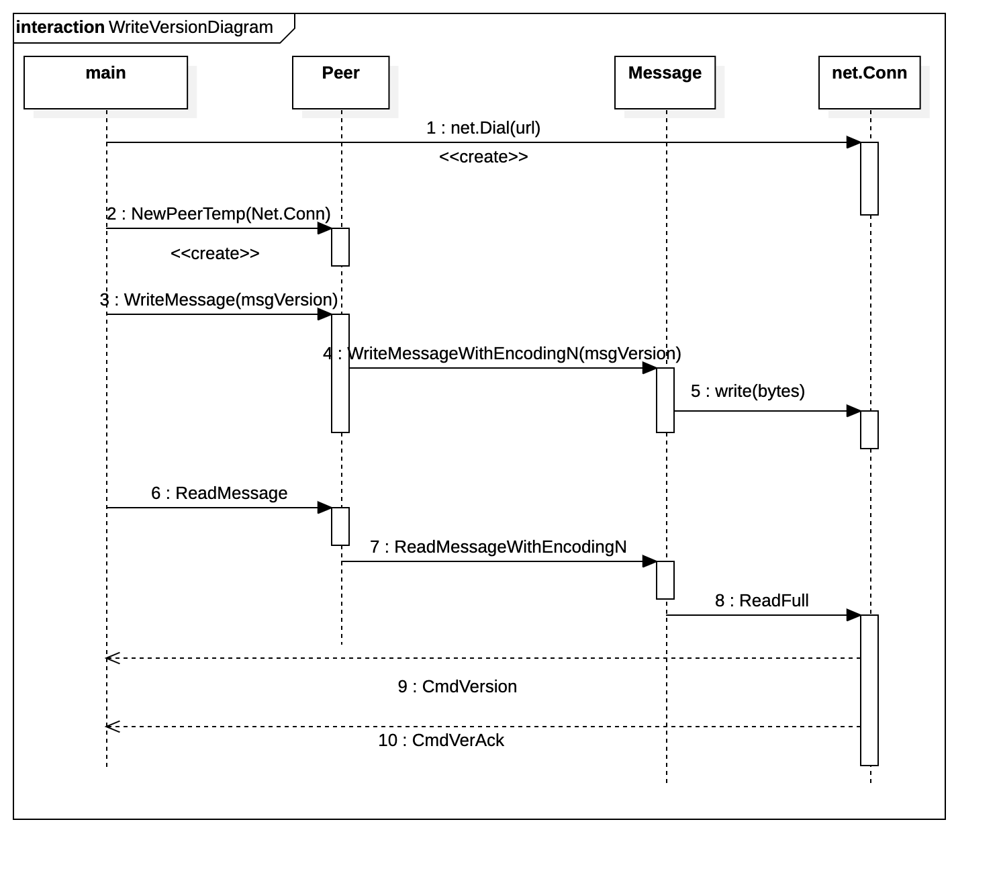

图说比特币 Part 1
======


# 1.1引言

这个系列使用**golang**从零开始写一个**比特币轻量化节点**。最终达到和实际的比特币网络进行交易和**SPV**(Simplified Payment Verification)。

注意：大部分代码都源自[BTCD](https://github.com/btcsuite/btcd)，实际上也是一个**[BTCD](https://github.com/btcsuite/btcd)源码分析**文章。最终实现以下功能：
1. 连接到比特币的网络(包括 mainnet, testnet, simnet)
2. 加入到比特币网络(“version handshake”)
3. 向其他节点获取blockchain state
4. 下载blockhain heads
5. 实现**SPV**(Simplified Payment Verification)
6. **交易**比特币

**注：阅读前请确认已经对比特币的区块链结构已经有初步的了解。**

## 1.2代码地址
[图说比特币Part_1](https://github.com/ke-chain/btck/tree/part_1)

## 1.3搭建测试网络

编程初期我们使用BCTD自带的测试网络。测试网络的配置如下:
```
# btcd.conf
[Application Options]
datadir=./btcd/data

listen=127.0.0.1:9333

simnet=1

nobanning=1
debuglevel=debug
```

1. `listen` 是测试网络的ip
2. `simnet` 代表模拟网络(Simulation Network)
3. `nobanning` 不要禁止任何节点
4. `debuglevel=debug` 输出日志信息

启动终端输入命令： `btcd --configfile ./btcd.conf` 即可启动测试网络。

## 1.4 节点建立连接


比特币系统中，节点通过进行初始 **“握手”**，建立连接。
Version：版本消息(关键内容：版本号，当前节点区块链的区块高度)
Verack：确认已收到消息

 **part 1 的最终效果就是与比特币网络发送和接受消息，建立连接。**
## 1.5代码结构



## 1.6 时序图



## 1.7 通信协议

追求妹子的第一步是了解对方想要什么，比如刚认识的时候首先看看颜值，颜值不行的基本就是冷处理备胎好人卡三连了。节点间通信也是一样，一开始的时候先看看版本，版本不行的也是被拒绝的下场。

```go
// #msgversion.go
type MsgVersion struct {
	// Version of the protocol the node is using.
	ProtocolVersion int32

	// Bitfield which identifies the enabled services.
	Services ServiceFlag

	// Time the message was generated.  This is encoded as an int64 on the wire.
	Timestamp time.Time

	// Address of the remote peer.
	AddrYou NetAddress

	// Address of the local peer.
	AddrMe NetAddress

	// Unique value associated with message that is used to detect self
	// connections.
	Nonce uint64

	// The user agent that generated messsage.  This is a encoded as a varString
	// on the wire.  This has a max length of MaxUserAgentLen.
	UserAgent string

	// Last block seen by the generator of the version message.
	LastBlock int32

	// Don't announce transactions to peer.
	DisableRelayTx bool
}

```

1. `ProtocolVersion`表示协议版本，版本号越大则代表版本越新。详见[Protocol Versions](https://bitcoin.org/en/developer-reference#protocol-versions)

2. `Services` 代表节点支持的服务。暂时使用`1`表示全节点
3. `UserAgent` 类似于http协议的`User-Agent` ，包含节点软件的名称和版本
4. `LastBlock` 代表最新区块的高度


`MsgVersion`代表了需要发送的**内容**。
由于消息的底层是**字节序列**,所有我们需要约定好字节序列的格式。

```go
// #message.go
type messageHeader struct {
	magic    BitcoinNet // 4 bytes
	command  string     // 12 bytes
	length   uint32     // 4 bytes
	checksum [4]byte    // 4 bytes
}
```

1. `magic` 表示网络类型，目前用`SimNet`表示测试网络。
2. `command` 表示命令名称，目前用`CmdVersion`表示这是获取版本的命令。
3. `length` 表示**数据内容**的长度。
4. `checksum` **数据内容**的双重哈希。

**数据内容**的获取接口为下方的`BtcEncode`。
**数据内容的最大长度**的获取接口为下方的`MaxPayloadLength`。
**命令名称**的获取接口为下方的`Command`。
```go
// #message.go
type Message interface {
	BtcDecode(io.Reader, uint32, MessageEncoding) error
	BtcEncode(io.Writer, uint32, MessageEncoding) error
	Command() string
	MaxPayloadLength(uint32) uint32
}
```

最终发送的消息字节序列格式：
```
BYTES(Msg.magic) + BYTES(Msg.Command()) + BYTES(Msg.length) + BYTES(Msg.checksum) + BYTES(Msg.BtcEncode())
```

## 1.8测试：

结果如下：
```bash
$ go run ./
INFO[0000] version70013                                 
INFO[0000] verack  
```

## 1.9总结：

关键内容是message的解构，有消息头和消息组成。

最终发送的消息字节序列格式：
```
BYTES(Msg.magic) + BYTES(Msg.Command()) + BYTES(Msg.length) + BYTES(Msg.checksum) + BYTES(Msg.BtcEncode())
```


参考资料：
[BTCD](https://github.com/btcsuite/btcd)
[比特币消息协议](https://en.bitcoin.it/wiki/Protocol_documentation#version)
[Tinybit](https://github.com/Jeiwan/tinybit/tree/part_1)
《比特币白皮书》
《解构区块链》


