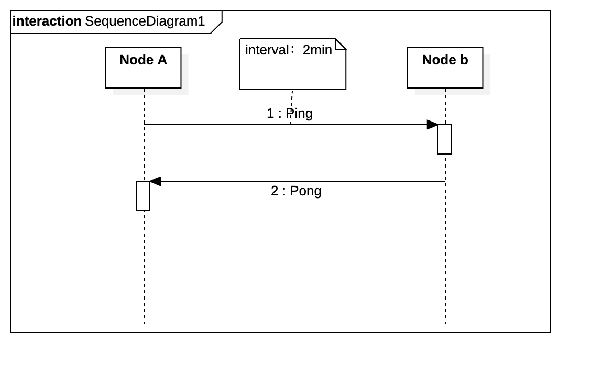
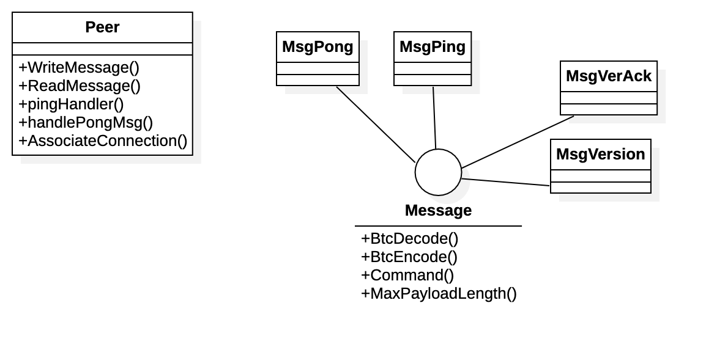
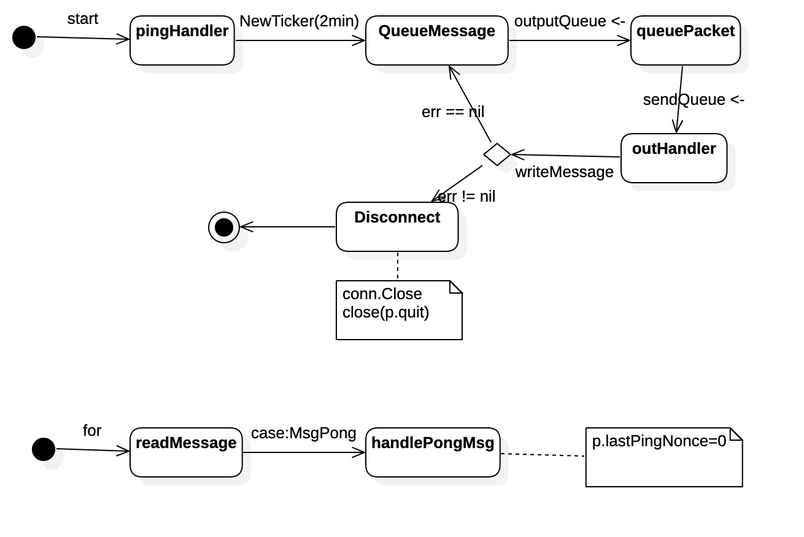

图说比特币 Part 2:心跳信息
======

> 备注：为了简洁起见，文章只涉及了部分关键代码和结构。推荐下载源码，查看详细实现。

# 1.1引言
上个文章中实现了发送和接受`version` 和 `verack`，即建立连接。建立连接后需要保持连接，[BTCD](https://github.com/btcsuite/btcd)保持连接的方式是发送和接受 **`ping`** 和 **`pong`** 信息。


## 1.2代码地址

## 1.3 心跳信息


1. 节点A发送`ping`
2. 节点B收到`ping`并返回`pong`

## 1.4代码结构


 `pingHandle()`:两分钟发送一次`ping`消息，如果没收到返回信息就删除节点。
 `handlePongMsg()`:重置`ping`相关的信息(BIP0031 版本后)。
 `AssociateConnection()`:封装了part 1中发送和接受‘version` 和 ‘verack`的过程。

## 1.5 `ping` `pong` 代码流程


`ping` `pong` 的流程都在Peer中完成。
每隔两分钟就会发送一次`ping`消息。
收到`ping`消息后返回`pong`消息。
## 1.6测试：
为了测试方便，将interval改为2秒。`setLogLevels("TRC")`，log设置为trace等级。

```bash
$ go run ./
2020-10-22 13:20:49.581 [DBG] PEER: Sending ping to 127.0.0.1:9333 (outbound)
2020-10-22 13:20:49.582 [DBG] PEER: Received pong from 127.0.0.1:9333 (outbound)
2020-10-22 13:20:49.582 [TRC] PEER: (*wire.MsgPong)(0xc000294150)({
 Nonce: (uint64) 5412366295126488733
})

2020-10-22 13:20:49.582 [TRC] PEER: ([]uint8) (len=8 cap=8) {
 00000000  9d b6 4f 2f 78 96 1c 4b                           |..O/x..K|
}

2020-10-22 13:20:51.579 [DBG] PEER: Sending ping to 127.0.0.1:9333 (outbound)
2020-10-22 13:20:51.580 [DBG] PEER: Received pong from 127.0.0.1:9333 (outbound)
2020-10-22 13:20:51.580 [TRC] PEER: (*wire.MsgPong)(0xc00013ccd0)({
 Nonce: (uint64) 11266548846027506974
})

2020-10-22 13:20:51.580 [TRC] PEER: ([]uint8) (len=8 cap=8) {
 00000000  1e 85 0e 94 7b d2 5a 9c                           |....{.Z.|
}
```

## 1.7总结
本章主要完成两件事：
1. 将part 1 的发送和接受`version` 和 `verack`封装到`AssociateConnection()`中。
2.  发送和接受 **`ping`** 和 **`pong`** 信息，从而保持连接。


参考资料：
[BTCD](https://github.com/btcsuite/btcd)
[比特币消息协议](https://en.bitcoin.it/wiki/Protocol_documentation#version)
[Tinybit](https://github.com/Jeiwan/tinybit/tree/part_1)
《比特币白皮书》
《解构区块链》