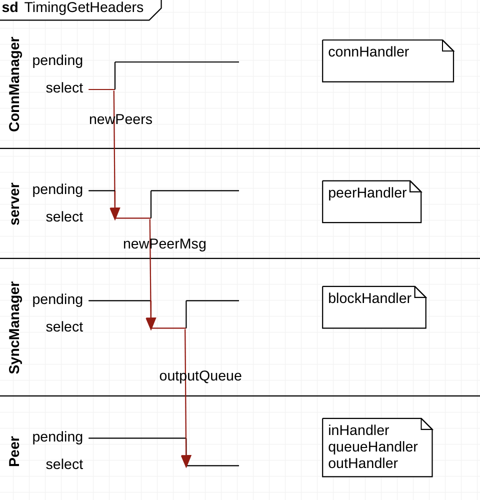

图说比特币 Part 5:如何优雅地并发？
======
> 备注：为了简洁起见，文章只涉及了部分关键代码和结构。推荐下载源码，查看详细实现。
## 1.1 引言
part 1 完成了"handshake"，part 2 "心跳"信息，part 3 加载配合文件，part 4完成了本地数据库的操作。
接下来我们将获取其它的节点的blockheads，并存储到本地。

## 1.2代码地址
[图说比特币 Part 5:图说比特币 Part 5:如何优雅地并发？](https://github.com/ke-chain/btck/tree/part_5)

## 1.3准备环境

#### 安装btcwallet
1. `cd ~/.tmp`
2. `git clone https://github.com/btcsuite/btcwallet`
3. `cd btcwallet`
4. `go install -v . ./cmd/...`

#### 创建钱包
接下来创建两个钱包：一个用于挖矿(miner)，一个用于消费(alice)

1. `btcwallet -C ./btcwallet.conf --create`
注：btcwallet.conf等配置文件都在源码当中。
```
Enter the private passphrase for your new wallet:
Confirm passphrase:
Do you want to add an additional layer of encryption for public data? (n/no/y/yes) [no]: no
Do you have an existing wallet seed you want to use? (n/no/y/yes) [no]: no
Your wallet generation seed is:
...
Once you have stored the seed in a safe and secure location, enter "OK" to continue: OK
Creating the wallet...
[INF] WLLT: Opened wallet
```
创建需要输入四个选项。密码设置为1，接下来no,no,OK.
2. 开启两个终端，分别启动btcd server和钱包 server
```
// Console window 1
$ btcd --configfile ./btcd.conf

// Console window 2
$ btcwallet -C ./btcwallet.con
```

3. 创建钱包用户
```
$ btcctl -C ./btcctl-wallet.conf walletpassphrase 1 3600
$ btcctl -C ./btcctl-wallet.conf createnewaccount alice
$ btcctl -C ./btcctl-wallet.conf listaccounts
{
  "alice": 0,
  "default": 0,
  "imported": 0
}
```

4. 查看miner和alice的地址
```
// Unlock your wallet first
$ btcctl -C ./btcctl-wallet.conf walletpassphrase 1 3600
$ btcctl -C ./btcctl-wallet.conf getnewaddress
MINER_ADDRESS
$ btcctl -C ./btcctl-wallet.conf getnewaddress alice
ALICE_ADDRESS
```
5. 使用miner地址重启btcd server
```
$ btcd --configfile ./btcd.conf --miningaddr=MINER_ADDRESS
```

6. 生成测试区块和交易
```
$ btcctl -C ./btcctl.conf generate 100
[...a hundred of hashes...]
$ btcctl -C ./btcctl-wallet.conf getbalance
50
```

## 1.4 getHeaders通信协议

>GetHeaders
>Added inprotocol version 31800.
>
>The “getheaders” message requests a “headers” message that provides block headers starting from a particular point in the block chain. It allows a peer which has been disconnected or started for the first time to get the headers it hasn’t seen yet.
>
>The “getheaders” message is nearly identical to the “getblocks” message, with one minor difference: the inv reply to the “getblocks” message will include no more than 500 block header hashes; the headers reply to the “getheaders” message will include as many as 2,000 block headers.

通过发送getheaders消息，可以获取区块头。

```go
type MsgGetHeaders struct {
	ProtocolVersion    uint32
	BlockLocatorHashes []*chainhash.Hash
	HashStop           chainhash.Hash
}
```

## 1.5 Share Memory By Communicating


>Go's concurrency primitives - goroutines and channels - provide an elegant and distinct means of structuring concurrent software.Instead of explicitly using locks to mediate access to shared data, Go encourages the use of channels to pass references to data between goroutines. This approach ensures that only one goroutine has access to the data at a given time. 

golang处理并发使用 `goroutines and channels`，这是方式简洁并且直观。
golang通过`channels`传递数据的引用来确保同一时间只有一个`goroutine`可以访问数据。
传统的同步方式是使用锁：
```
func Poller(res *Resources) {
    for {
        // get the least recently-polled Resource
        // and mark it as being polled
        res.lock.Lock()
        var r *Resource
        for _, v := range res.data {
            if v.polling {
                continue
            }
            if r == nil || v.lastPolled < r.lastPolled {
                r = v
            }
        }
        if r != nil {
            r.polling = true
        }
        res.lock.Unlock()
        if r == nil {
            continue
        }

        // poll the URL

        // update the Resource's polling and lastPolled
        res.lock.Lock()
        r.polling = false
        r.lastPolled = time.Nanoseconds()
        res.lock.Unlock()
    }
}
```

golang的方式实现是这样的：
```
type Resource string

func Poller(in, out chan *Resource) {
    for r := range in {
        // poll the URL

        // send the processed Resource to out
        out <- r
    }
}
```


## 1.6 获取headers



如上图所示，获取`headers`涉及6个`goroutine`。
[`ConnManager`]:`connHandler`
[`server`]:`peerHandler`
[`SyncManager`]:`blockHandler`
[`Peer`]:`inHandler`,`queueHandler`,`outHandler`

通过`channel`:`newPeers`,`newPeerMsg`,`outputQueue`等来传递数据。


## 1.7 测试
``` sh
$  go run ./ --configfile ./configke.conf

```

参考资料：
[Share Memory By Communicating](https://blog.golang.org/share-memory-by-communicating)
[Bitcoin Protocol documentation](https://en.bitcoin.it/wiki/Protocol_documentation)

