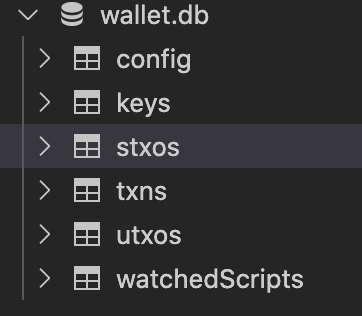
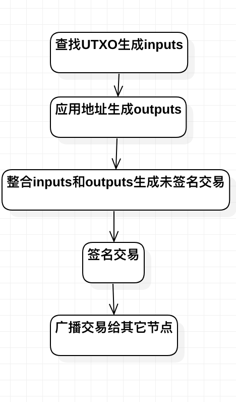

图说比特币 Part 6:交易
======
> 备注：为了简洁起见，文章只涉及了部分关键代码和结构。推荐下载源码，查看详细实现。


## 1.1 引言
正如第一篇文章讲的，本系列的目标是完成以下feature：

1. 连接到比特币的网络(包括 ~~mainnet, testnet,~~ simnet)
2. 加入到比特币网络(“version handshake”)
3. 向其他节点获取blockchain state
4. 下载blockhain heads
5. 实现**SPV**(Simplified Payment Verification)
6. **交易**比特币

目前已经在simnet实现了全部功能。我希望尽早做Hyperledger Fabric的源码研究，所以mainnet, testnet的调试就略过了。

继上一章完了获取Header之后，今天则要完成的任务有点多。
**创建钱包->新建地址->消费->获取余额**

## 1.2代码地址
[图说比特币 Part 6:交易](https://github.com/ke-chain/btck/tree/part_6)

## 1.3 创建钱包

比特币钱包存储两样东西，一个是秘钥，一个是交易。
钱包大体分为两类:Deterministic (Seed) Wallet和Nondeterministic(Random) Wallet。区别是前者根据一个Seed生成大量秘钥，后者则是随机生成互不相关的秘钥。我们使用Deterministic (Seed) Wallet (后面简称HD)，根据一个Seed生成多个相关的秘钥。
表结构如下：



- `config`:存储mnemonic(就是HD钱包的Seed)，creationDate
- `keys`:存储生成的秘钥和地址
- `stxos`: 已消费的utxo
- `txns`:钱包相关的交易
- `utxos`: utxo(UNspended transaction outputs)
- `watchedScripts`:关注的脚本，会下载Scripts相关的交易

## 1.4 新建地址

```sh
$ go run ./ newaddress    
SdDRDVuL1uqKJM2bd8UFvBLH8dzqZksYaq
```
`SdDRDVuL1uqKJM2bd8UFvBLH8dzqZksYaq`就是返回的地址

## 1.5 消费5个btc
```sh
$ go run ./ spend SXAjjkz2hQVJFTe4oJoRUKeZ4keYocuJnW 5    
... 
```
`SXAjjkz2hQVJFTe4oJoRUKeZ4keYocuJnW`是接收方的地址 
在btcd的server中，会有以下log:
```sh 

2020-11-13 13:34:54.199 [DBG] PEER: Received tx (hash 1d4076014ec328a86f2f53b894d06f7f501276e5e05d5fa401ff8e8d48a1bb5d, 1 inputs, 2 outputs, lock height 0) from 127.0.0.1:61134 (inbound)
2020-11-13 13:34:54.199 [TRC] PEER: (*wire.MsgTx)(0xc000194140)({
 Version: (int32) 1,
 TxIn: ([]*wire.TxIn) (len=1 cap=1) {
  (*wire.TxIn)(0xc000088c00)({
   PreviousOutPoint: (wire.OutPoint) 42914b3d2a6fe321fc8cf04b1dc0af02c75b329fe7eab2c2110d3b9ee4e7f9ac:1,
   SignatureScript: ([]uint8) {
   },
   Witness: (wire.TxWitness) <nil>,
   Sequence: (uint32) 0
  })
 },
 TxOut: ([]*wire.TxOut) (len=2 cap=2) {
  (*wire.TxOut)(0xc000194180)({
   Value: (int64) 500000000,
   PkScript: ([]uint8) (len=25 cap=25) {
    00000000  76 a9 14 6c 51 94 31 2f  0c a9 36 52 1d 74 b9 34  |v..lQ.1/..6R.t.4|
    00000010  02 44 57 ef f3 53 68 88  ac                       |.DW..Sh..|
   }
  }),
  (*wire.TxOut)(0xc0001941a0)({
   Value: (int64) 9499771000,
   PkScript: ([]uint8) (len=25 cap=25) {
    00000000  76 a9 14 be 2f fb 00 7e  72 5b 40 10 87 9b 0b 4d  |v.../..~r[@....M|
    00000010  93 3a e3 01 ed 99 bb 88  ac                       |.:.......|
   }
  })
 },
 LockTime: (uint32) 0
})

...

Accepted transaction 1d4076014ec328a86f2f53b894d06f7f501276e5e05d5fa401ff8e8d48a1bb5d (pool size: 1)

```


> **消费**需要启动本地的`server`用于广播交易。


## 1.6 获取余额
```sh
$ go run ./ balance    
204.99771 0
```
`204.99771`现实已确认的金额，`0`代表未确认的金额。单位是btc


## 1.7 总结

这系列的名字应该叫：从零创建一个比特币钱包。
下一个Hyperledger Fabric 系列的目标：
1. 着重分析一小片代码，解释其背后的原因，而不是这种整个项目的流水账。
2. 不使用术语
3. 使用互动形风格


## 参考资料：
[Bitcoin Protocol documentation](https://en.bitcoin.it/wiki/Protocol_documentation)
[BTCD](https://github.com/btcsuite/btcd)
[spvwallet](github.com/OpenBazaar/spvwallet)
[Building Blockchain in Go](https://jeiwan.cc/posts/building-blockchain-in-go-part-6/)
[Programming Bitcoin Network](https://github.com/Jeiwan/tinybit/tree/part_4)
《Mastering Bitcoin》第5，6，7章
《解构区块链》

